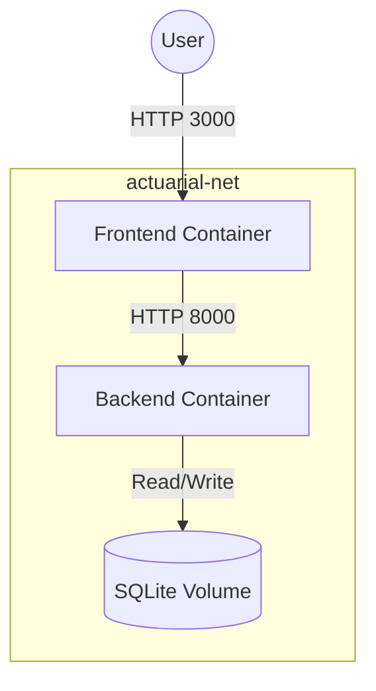

# Production Docker Deployment Guide

This document outlines the container architecture, build process, and deployment strategies for the Actuarial Assumption Monitoring Agent.

## 1. Docker Architecture

The application uses a standard microservices architecture consisting of two primary containers managed by Docker Compose.



## 2. Container Structure

### Backend (`actuarial-backend`)
- **Base Image**: `python:3.12-slim` (minimal footprint, secure).
- **Process**: FastAPI managed by `uvicorn` in production mode (no auto-reload).
- **Port**: `8000` (configurable via `PORT`).
- **Security**: Runs as a non-root user (`appuser`).
- **Storage**: Maps `/app` to the `actuarial_db` Docker volume for SQLite persistence.

### Frontend (`actuarial-frontend`)
- **Base Image**: `node:20-alpine` (multi-stage build).
- **Process**: Next.js Standalone server (`node server.js`).
- **Port**: `3000`.
- **Security**: Runs as a non-root user (`nextjs`).
- **Optimization**: Only includes the `.next/standalone` output to drastically reduce image size (usually <150MB).

## 3. Environment Variables

Create `.env` files in both `/frontend` and `/backend` based on the provided `.env.example` templates.

**Backend (`backend/.env`)**
- `PORT`: 8000
- `HOST`: 0.0.0.0
- `GEMINI_API_KEY`: Required for the AI investigation planner.

**Frontend (`frontend/.env`)**
- `NEXT_PUBLIC_API_URL`: The URL where the frontend can reach the backend (e.g., `http://localhost:8000`).

## 4. Building and Running

To spin up the entire application stack:

```bash
docker compose up --build -d
```

To stop the stack:

```bash
docker compose down
```

To wipe the persistent database volume (Hard Reset):

```bash
docker compose down -v
```

## 5. Health Checks

The backend provides several production-ready health endpoints:
- `GET /api/health`: Basic liveness probe.
- `GET /api/ready`: Readiness probe verifying DB connection and Planner API keys.
- `GET /api/version`: System version and environment state.

## 6. Cloud Deployment Instructions

### Render / Railway
1. Connect your GitHub repository.
2. Create two services: a **Web Service** (Backend) and a **Static Site / Web Service** (Frontend).
3. Set the Root Directory for each service (`/backend` and `/frontend`).
4. Inject `GEMINI_API_KEY` into the backend service variables.
5. Inject `NEXT_PUBLIC_API_URL` into the frontend service variables, pointing to the backend's public URL.

### Google Cloud Run
1. Build and push the images to Google Container Registry (GCR):
   ```bash
   gcloud builds submit --tag gcr.io/[PROJECT_ID]/actuarial-backend ./backend
   gcloud builds submit --tag gcr.io/[PROJECT_ID]/actuarial-frontend ./frontend
   ```
2. Deploy both images as Cloud Run services. Set the environment variables in the Cloud Run console.

### Azure Container Apps
1. Use the Azure CLI to create an environment:
   ```bash
   az containerapp env create -n actuarial-env -g my-resource-group --location eastus
   ```
2. Deploy the backend and frontend using `az containerapp create`, passing the ACR image URIs and environment variables.
